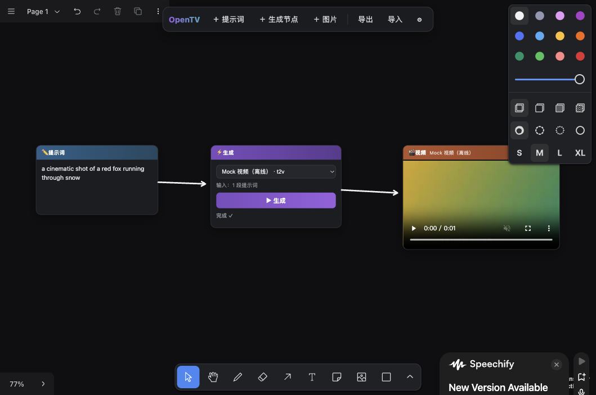

# OpenTV

**Open-source infinite canvas for AI image & video generation — run open models locally, on a canvas made for creators.**

ComfyUI won the open-model wave for tinkerers; card-canvas tools won creators but stayed closed-source and cloud-only. OpenTV is the missing piece: a **libtv-style card canvas** that runs **open-source video models on your own machine**.

一句话：卡片连线的无限画布 + 本地开源模型。ComfyUI 的开放，创作者画布的体验。



## Why

- Open-source video models (Wan, LTX-Video, HunyuanVideo…) are getting good, fast — and fp8 distills already run on consumer GPUs.
- The day an open model hits closed-model quality, everyone will want a canvas to use it in — and every canvas that exists today is closed and metered.
- OpenTV is built for that day: local-first, provider-agnostic, yours.

## Quick start

```bash
git clone https://github.com/eli-verse/opentv
cd opentv && pnpm install && pnpm dev
```

Open http://localhost:5173 — the canvas works immediately with the offline mock models.

### Generate with local open-source models (ComfyUI backend)

1. Run [ComfyUI](https://github.com/comfyanonymous/ComfyUI) locally (default `127.0.0.1:8188` — the dev server proxies it automatically; set `OPENTV_COMFY_URL` to override).
2. **Images**: works out of the box with any checkpoint in your ComfyUI (`本地出图` model).
3. **Video**: run any video template (Wan / LTX-Video / Hunyuan) once in ComfyUI, export it in **API format**, replace the prompt text with `{{prompt}}` (optionally seed with `{{seed}}`), and paste it into OpenTV ⚙ Settings. Your model, your workflow, on the canvas.

### Generate with cloud models (optional)

Paste a [fal.ai](https://fal.ai) API key in ⚙ Settings — FLUX, Wan and Kling are pre-wired for machines without a GPU.

## How it works

- **Canvas**: [tldraw](https://tldraw.dev)-based infinite canvas. Cards are shapes; wires are arrows.
- **Cards are the artwork**: type a prompt on a generation card and hit Enter — the media fills the card itself. `↻` regenerate in place, `🎲` spawn a variation, `🎬` bring an image to life (image-to-video). Derived cards auto-wire provenance arrows; drawing an arrow into a card by hand adds a reference (notes add prompt text, images become the i2v source).
- **Providers**: one protocol, three backends — `comfy` (local, the point of this project), `fal` (cloud), `mock` (offline demo). Adding a backend is one file: see `src/providers/`.
- **Projects**: autosaved to the browser; export/import as JSON.

## Roadmap

- [ ] Built-in model downloads & native local runner (no ComfyUI required)
- [ ] Batch / multi-shot generation, seeds & variations
- [ ] First-class i2v + keyframe chains (card → card → card = shot list)
- [ ] Import from closed canvas tools
- [ ] Plugin protocol for community nodes

## License

MIT
